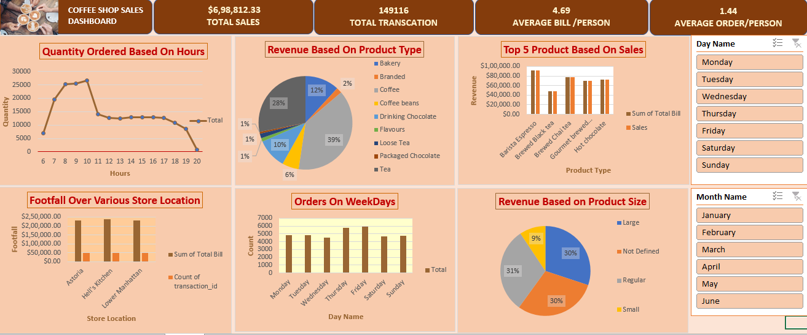

# -Coffee-Shop-Sales-Dashboard-
The goal of this project was to build a clean, professional, and fully interactive sales dashboard without the use of any external tools or add-ins—purely leveraging Excel’s built-in functionalities such as Pivot Tables, Pivot Charts, and Slicers.

📊 Dashboard Highlights
Key KPIs Displayed:

Total Sales

Total Transactions

Average Bill per Person

Average Orders per Person

Visual Analysis:

📈 Quantity Ordered Based on Hour of the Day

🧁 Revenue Distribution by Product Type (e.g., Coffee, Tea, Bakery, etc.)

🥇 Top 5 Best-Selling Products Based on Revenue

📍 Footfall Analysis across Store Locations

📅 Orders by Weekdays

📦 Revenue by Product Size (Small, Regular, Large)

Filters & Interactivity:

Day-wise Slicer (Monday to Sunday)

Month-wise Slicer (January to June)

Real-time chart updates based on filter selection

⚙️ Tools & Techniques Used
Microsoft Excel 2019

Pivot Tables

Pivot Charts

Slicers for Interactivity

Data Cleaning and Formatting

Conditional Formatting

Dashboard Design Principles

🎯 Objective
To enable business stakeholders—such as managers and marketing teams—to make informed decisions by quickly identifying top-performing products, peak hours, and high-traffic store locations. The dashboard serves as a compact BI tool to monitor and analyze operational data in real time.

📌 Use Cases
Inventory planning

Staffing decisions based on peak hours

Targeted marketing for high-revenue products

Location-based performance comparison

Seasonal or monthly trend analysis

📁 Preview

Feel free to use the edited version of the image you just created.

✅ Outcome
This project helped sharpen my Excel skills in real-world data analysis, enhanced my dashboarding abilities, and strengthened my understanding of how to present complex datasets in a clear, actionable format.

